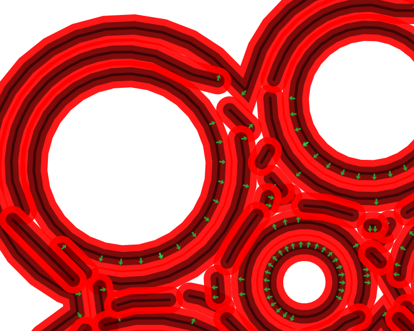
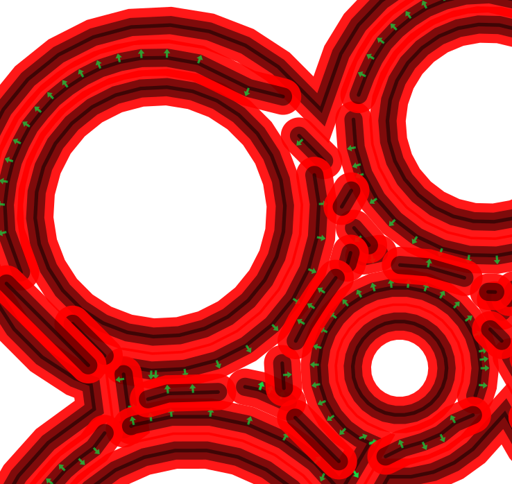
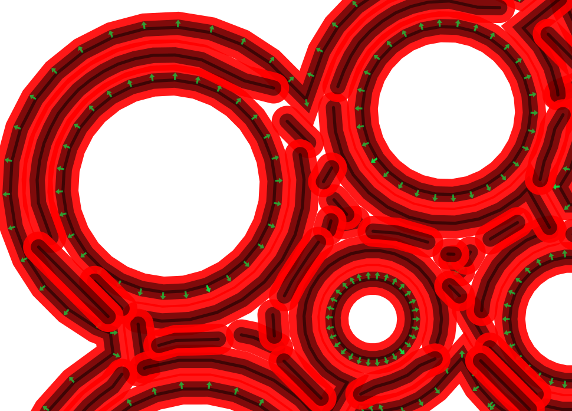
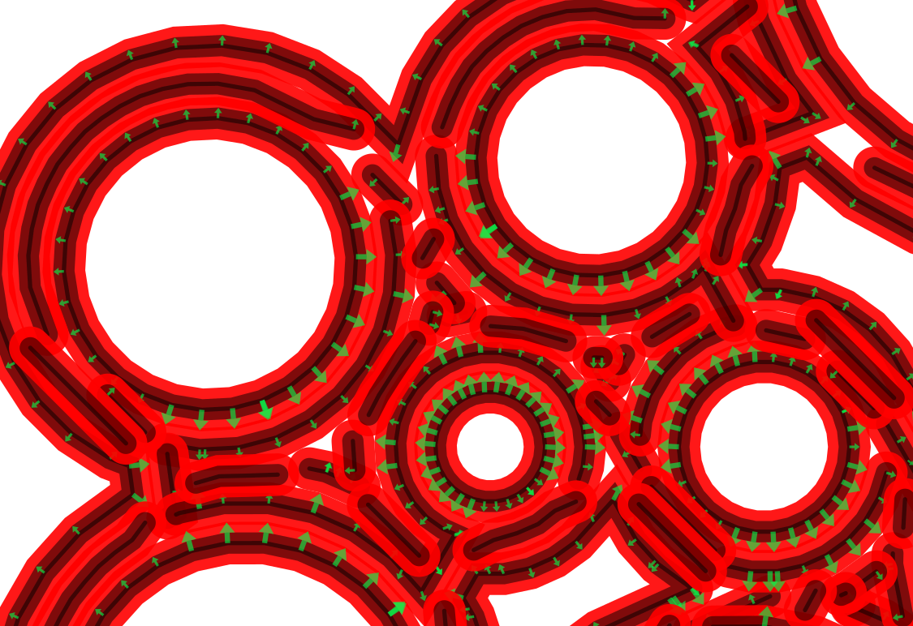

# Usage

The only mandatory parameter is the g-code file.

```sh
post_stretch infile >outfile
```

The program outputs a modified g-code file, which can be used in place of the initial g-code file
to print more accurate shapes.

The operation is governed by several parameters:

```
post_stretch --help

Usage: post_stretch infile [options]
Allowed options:

Generic options:
  -v [ --version ]      print version string
  --help                produce help message
  -c [ --config ] arg   configuration file

Allowed options:
  --stretch arg (=170)  Stretch distance in microns
  --width arg (=700)    Wall width in microns
  --nozzle arg (=800)   Nozzle diameter in microns
  --dumpLayer arg (=0)  Debug one layer
```

The most important parameter is _stretch_

If the stretch factor is zero, the input and output files should be identical.
So the following operation is a "no operation"

```sh
post_stretch --stretch 0 spirale.gcode >spirale2.gcode
```

Increasing values of the stretch parameter generate higher distorsions to compensate
for natural stretch of the material. A normal value is between 100 and 200 microns.

```sh
post_stretch --stretch 170 spirale.gcode >spirale2.gcode
```

## Build

The program is written in C++11 and so need a "not too old" version of the C++ compiler.

The makefile generator is CMake from https://cmake.org. Minimum version is 3.0 to allow C++11

The GCode parser uses boost libraries from http://www.boost.org. A "devel" version greater than 1.54 must be installed.

Debug images are generated using cairo (http://www.cairographics.org).


This is a typical generation under Linux, starting from the directory containing this README:

```sh
mkdir build &&
cd build &&
cmake -DCMAKE_INSTALL_PREFIX=/usr -DCMAKE_BUILD_TYPE=Release ..

make

sudo make install
```


# Internals


The first step consists in extracting sequences of points with uninterrupted
filament flow. Each sequence is then considered individually, the begin and
the end of the sequence are considered unconnected (material flow is cut)

For each sequence, the deposited material will eventually shrink during its cooling,
in a direction which depends on its initial shape and the neighbouring:
The material deposited *before* the current sequence in the same layer.

The program uses three different algorithms: *PushWall*, *WideTurn* and *WideCircle*

### PushWall

When material is extruded at a position which touches a previously deposited wall,
it is pushed back by the wall.

To cancel this movement, the algorithm forces an opposite movement, it goes closer to the wall.

In the following picture, the cancelling effect is shown by green arrays. The black lines are the initial, wanted, positions.



The algorithm moves the initial points only if there is material previously extruded for the same layer
at one side of the current segment, but not at both sides. If the segment is surrounded by walls, the initial positions
are kept.

### WideTurn



### WideCircle

The *WideCircle* algorithm is derived from the *WideTurn* algorithm when the first point
of a sequence is the same as its last point. We may is this case consider that the extruded shape
will be a closed polygon, which will shrink during cooling.




### All together

When all algorithms are activated, effects are cumulative


